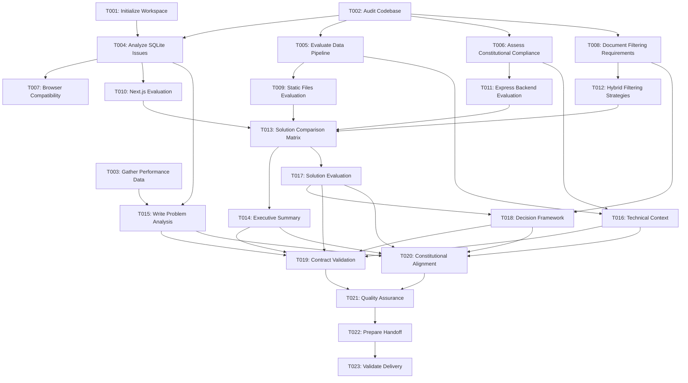

# Tasks: Frontend Architecture Problem Analysis Document

**Input**: Design documents from `/specs/018-write-the-problem/`
**Prerequisites**: plan.md (required), research.md, data-model.md, contracts/

## Execution Flow (main)
```
1. Load plan.md from feature directory
   ✓ Found: Frontend Architecture Problem Analysis Document
   ✓ Extract: TypeScript/React/Vite, documentation project
2. Load optional design documents:
   ✓ data-model.md: Extract entities → analysis tasks
   ✓ contracts/: Document structure contract → validation tasks
   ✓ research.md: Extract decisions → research consolidation tasks
3. Generate tasks by category:
   → Setup: Workspace preparation, prerequisite gathering
   → Analysis: Current codebase analysis, performance measurement
   → Research: Solution evaluation, decision framework creation
   → Documentation: Content creation, quality validation
   → Handoff: Architect preparation, delivery validation
4. Apply task rules:
   → Different analysis areas = mark [P] for parallel
   → Sequential documentation assembly (no [P])
   → Analysis before synthesis
5. Number tasks sequentially (T001, T002...)
6. Generate dependency graph
7. Create parallel execution examples
8. Validate task completeness:
   ✓ All entities have analysis tasks
   ✓ All solution approaches evaluated
   ✓ Constitutional compliance verified
   ✓ Document contract validated
```

## Task Breakdown

### Setup Phase (T001-T003)
**T001** - Initialize Documentation Workspace [P]
- **Scope**: Create document template and gather prerequisite information
- **Files**: Create main document file, setup workspace structure
- **Time**: 15 minutes
- **Dependencies**: None
- **Validation**: Workspace ready, prerequisites accessible

**T002** - Audit Current Codebase Assets [P]
- **Scope**: Inventory existing codebase, data files, and build configurations
- **Files**: Analyze `/src`, `/out`, build configs, constitutional requirements
- **Time**: 30 minutes
- **Dependencies**: None
- **Validation**: Complete asset inventory with file sizes and capabilities

**T003** - Gather Performance Baseline Data [P]
- **Scope**: Document current performance metrics and pain points
- **Files**: Measure load times, database sizes, complexity indicators
- **Time**: 20 minutes
- **Dependencies**: None
- **Validation**: Quantified performance data available

### Analysis Phase (T004-T008)
**T004** - Analyze SQLite/OPFS Integration Issues
- **Scope**: Document current approach problems and constitutional violations
- **Files**: Analyze current wa-sqlite implementation, OPFS complexity
- **Time**: 45 minutes
- **Dependencies**: T002 (codebase audit)
- **Validation**: Root cause analysis complete with specific issues identified

**T005** - Evaluate Data Pipeline Assets [P]
- **Scope**: Document existing transform pipeline capabilities and outputs
- **Files**: Analyze `/out` directory, transform scripts, pre-filtered datasets
- **Time**: 30 minutes
- **Dependencies**: T002 (codebase audit)
- **Validation**: Complete inventory of data assets with sizes and formats

**T006** - Assess Constitutional Compliance [P]
- **Scope**: Map current approach against constitutional principles
- **Files**: Review constitution.md, evaluate current violations
- **Time**: 25 minutes
- **Dependencies**: T002 (codebase audit)
- **Validation**: Compliance matrix with violation identification

**T007** - Document Browser Compatibility Constraints [P]
- **Scope**: Analyze OPFS/WASM browser support limitations
- **Files**: Research browser compatibility matrix, user impact
- **Time**: 20 minutes
- **Dependencies**: T004 (SQLite analysis)
- **Validation**: Compatibility constraints documented with user impact

**T008** - Quantify Advanced Filtering Requirements
- **Scope**: Define specific filtering capabilities needed for nutrition app
- **Files**: Document halal compliance, protein optimization, cutting/bulking needs
- **Time**: 35 minutes
- **Dependencies**: T002 (codebase audit)
- **Validation**: Filtering requirements specified with performance criteria

### Solution Evaluation Phase (T009-T013)
**T009** - Evaluate Static File Serving Approach [P]
- **Scope**: Analyze pros/cons of serving pre-filtered JSONL files directly
- **Files**: Review existing filtered datasets, assess filtering limitations
- **Time**: 40 minutes
- **Dependencies**: T005 (data pipeline analysis)
- **Validation**: Complete pros/cons analysis with constitutional compliance

**T010** - Evaluate Next.js Server Components Approach [P]
- **Scope**: Research Next.js SSG with better-sqlite3 at build time
- **Files**: Research Next.js patterns, migration complexity, build-time queries
- **Time**: 50 minutes
- **Dependencies**: T004 (current approach analysis)
- **Validation**: Migration approach documented with complexity assessment

**T011** - Evaluate Express Backend Approach [P]
- **Scope**: Analyze development proxy with static build approach
- **Files**: Research development patterns, build-time data generation
- **Time**: 35 minutes
- **Dependencies**: T006 (constitutional compliance)
- **Validation**: Approach evaluated against static deployment requirement

**T012** - Evaluate Hybrid Filtering Strategies [P]
- **Scope**: Research static pages + client-side refinement approaches
- **Files**: Analyze filtering trade-offs, performance implications
- **Time**: 45 minutes
- **Dependencies**: T008 (filtering requirements), T009 (static approach)
- **Validation**: Filtering strategy matrix with performance analysis

**T013** - Create Solution Comparison Matrix
- **Scope**: Synthesize all solution evaluations into objective comparison
- **Files**: Consolidate T009-T012 analyses into comparison framework
- **Time**: 30 minutes
- **Dependencies**: T009, T010, T011, T012 (all solution evaluations)
- **Validation**: Objective pros/cons matrix ready for architect review

### Documentation Creation Phase (T014-T018)
**T014** - Write Executive Summary Section
- **Scope**: Create concise summary of problems and decision points for leadership
- **Files**: Main document - executive summary section
- **Time**: 25 minutes
- **Dependencies**: T013 (solution comparison)
- **Validation**: 1-2 paragraph summary suitable for technical leadership

**T015** - Write Current Problem Analysis Section
- **Scope**: Document quantified performance issues and complexity problems
- **Files**: Main document - problem analysis section
- **Time**: 40 minutes
- **Dependencies**: T004 (SQLite analysis), T003 (performance baseline)
- **Validation**: Problem section with quantified metrics and root causes

**T016** - Write Technical Context Section
- **Scope**: Document existing codebase assets and pipeline capabilities
- **Files**: Main document - technical context section
- **Time**: 35 minutes
- **Dependencies**: T005 (data pipeline), T006 (constitutional compliance)
- **Validation**: Complete technical inventory with constitutional mapping

**T017** - Write Solution Evaluation Section
- **Scope**: Present objective analysis of all explored approaches
- **Files**: Main document - solution evaluation section
- **Time**: 45 minutes
- **Dependencies**: T013 (solution comparison matrix)
- **Validation**: Balanced presentation of all approaches with trade-offs

**T018** - Write Decision Framework Section
- **Scope**: Define criteria and framework for architectural decisions
- **Files**: Main document - decision framework section
- **Time**: 30 minutes
- **Dependencies**: T008 (filtering requirements), T017 (solution evaluation)
- **Validation**: Clear decision criteria for architect evaluation

### Quality Validation Phase (T019-T021)
**T019** - Validate Document Contract Compliance [P]
- **Scope**: Review document against contracts/document-structure.md requirements
- **Files**: Review main document against contract specifications
- **Time**: 20 minutes
- **Dependencies**: T014-T018 (all documentation sections)
- **Validation**: Document meets all contract requirements

**T020** - Validate Constitutional Alignment [P]
- **Scope**: Ensure recommendations align with constitutional principles
- **Files**: Review document for constitutional compliance emphasis
- **Time**: 15 minutes
- **Dependencies**: T014-T018 (all documentation sections)
- **Validation**: Constitutional principles properly highlighted

**T021** - Perform Quality Assurance Review [P]
- **Scope**: Final review for completeness, objectivity, and technical accuracy
- **Files**: Complete document review with quality checklist
- **Time**: 25 minutes
- **Dependencies**: T019, T020 (validation tasks)
- **Validation**: Document ready for architect handoff

### Handoff Phase (T022-T023)
**T022** - Prepare Architect Handoff Package
- **Scope**: Organize document with supporting materials for architect review
- **Files**: Final document, supporting analysis, executive summary
- **Time**: 15 minutes
- **Dependencies**: T021 (quality assurance)
- **Validation**: Complete handoff package prepared

**T023** - Validate Delivery Requirements
- **Scope**: Confirm document enables architectural decision-making as required
- **Files**: Final validation against original requirements
- **Time**: 10 minutes
- **Dependencies**: T022 (handoff preparation)
- **Validation**: Document ready for frontend architect to make informed decisions

## Dependency Graph



## Parallel Task Execution

### Phase 1: Setup (Parallel)
```bash
# Can run simultaneously - different analysis areas
Task T001 & Task T002 & Task T003
```

### Phase 2: Core Analysis (Mixed)
```bash
# Sequential dependency chain
Task T004 (depends on T002)
# Then parallel analysis
Task T005 & Task T006 & Task T008 (all depend on T002)
# Then dependent analysis
Task T007 (depends on T004)
```

### Phase 3: Solution Evaluation (Mostly Parallel)
```bash
# Parallel solution research
Task T009 & Task T010 & Task T011 & Task T012
# Then synthesis
Task T013 (depends on T009-T012)
```

### Phase 4: Documentation (Sequential)
```bash
# Must be sequential - building single document
Task T014 → Task T015 → Task T016 → Task T017 → Task T018
```

### Phase 5: Validation (Parallel)
```bash
# Independent validation tasks
Task T019 & Task T020
# Then final steps
Task T021 → Task T022 → Task T023
```

## Task Agent Commands

### Example Parallel Execution (Phase 1)
```bash
Task T001: "Initialize documentation workspace and create document template for frontend architecture problem analysis"
Task T002: "Audit current codebase assets including /src, /out, build configs, and constitutional requirements"
Task T003: "Gather and document current performance baseline data including load times and database sizes"
```

### Example Sequential Execution (Phase 4)
```bash
Task T014: "Write executive summary section based on solution comparison matrix from T013"
# Wait for T014 completion, then:
Task T015: "Write current problem analysis section using SQLite analysis from T004 and performance data from T003"
# Continue sequentially...
```

## Completion Criteria

### Success Metrics
- [ ] All 6 entities from data-model.md have corresponding analysis tasks
- [ ] All 4 solution approaches from research.md have evaluation tasks
- [ ] Document contract requirements from contracts/ are validated
- [ ] Constitutional compliance is verified throughout
- [ ] Advanced filtering + performance requirements are clearly specified
- [ ] Frontend architect can make informed decisions based on document

### Deliverables
- [ ] Complete frontend architecture problem analysis document
- [ ] Executive summary suitable for technical leadership
- [ ] Objective solution evaluation matrix
- [ ] Clear architectural decision framework
- [ ] Constitutional compliance analysis
- [ ] Handoff package ready for architect review

**Total Estimated Time**: 8.5 hours
**Critical Path**: T002 → T004 → T013 → T017 → T018 → T021 → T023
**Parallel Opportunities**: Setup phase, analysis phase, validation phase